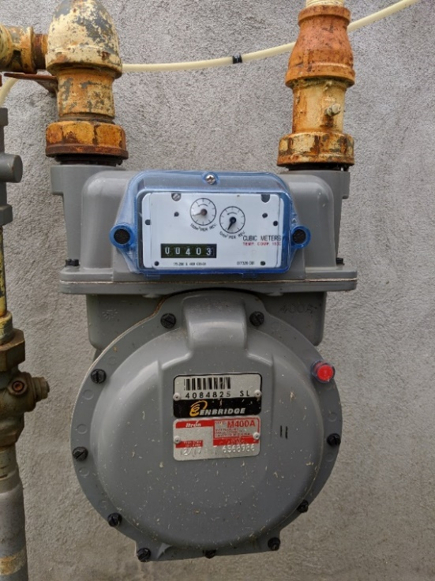
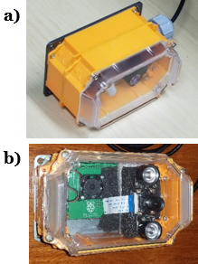
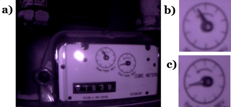
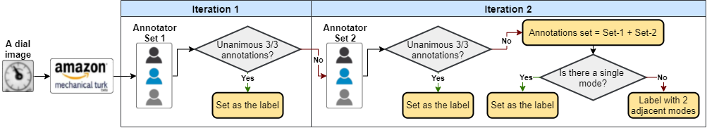

# NRC-GAMMA: A novel benchmark gas meter image dataset

Automatic meter reading technology is not yet widespread. Gas, electricity, or water accumulation meters reading is mostly done manually on-site either by an operator or by the
 homeowner. In some countries, the operator takes a picture as reading proof to confirm the reading by checking offline with another operator and/or using it as evidence in case
 of conflicts or complaints. The whole process is time-consuming, expensive, and prone to errors. Automation can optimize and facilitate such labor-intensive and human error-prone
 processes. With the recent advances in the fields of artificial intelligence and computer vision, automatic meter reading systems are becoming more viable than ever. Motivated by 
 the recent advances in the field of artificial intelligence and inspired by open-source open-access initiatives in the research community, we introduce a novel large benchmark 
 dataset of real-life gas meter images, named the __NRC-GAMMA__ dataset. The data were collected from an Itron 400A diaphragm gas meter on January 20, 2020, between 00:05 am and
 11:59 pm. We employed a systematic approach to label the images, validate the labellings, and assure the quality of the annotations. The dataset contains __28,883__ images of the
 entire gas meter along with __57,766__ cropped images of the left and the right dial displays. We hope the NRC-GAMMA dataset helps the research community to design and implement 
 accurate, innovative, intelligent, and reproducible automatic gas meter reading solutions.


**Update 11/12/2021:** NRC-GAMMA 1.0 is released. The dataset comprises __28,883__ images of the entire gas meter along with __57,766__ cropped images of the left and the right
 dial displays.


# 1. NRC-GAMMA dataset

## 1.1. The gas meter type
The data was collected from an Itron 400A gas meter installed and used in one of the test house facilities of the National Research Council of Canada (NRC), built in 2009 and 
located in Ottawa, Ontario. The gas meter is a light commercial (also suitable for high-load residential) gas diaphragm meter with a capacity of 400 ft3/hr (__Figure 1__). 

|__Figure 1.__ The Itron 400A gas diaphragm meter|
|:------------------------:|
||

## 1.2. The image capturing system
To ensure that the images are captured continuously and consistently, we built a smart image capturing system powered by advanced edge processing techniques able to capture images
 in different conditions during day and night (__Figure 2-a__ and __-b__). The system contained a Raspberry Pi 3b+, i.e., a small single-board computer, powered by a Power over 
 Ethernet (PoE) HAT that allows powering the Raspberry Pi board using PoE–enabled networks, a 5-megapixel infrared camera module (NoIR) that enabled us to take quality pictures 
 at night as well using infrared lighting. The components were all boxed in a weatherproof openH Rubicon IP67 case. 

|__Figure 2.__ The image capturing system, a) side view, b) front view|
|:------------------------:|
||

## 1.3. The dataset characteristics
The dataset contains two types of images:
 
1. Raw images of the gas meter (*n=28,883*)
2. Cropped images of the left and right dials (*n=57,766*, *160\*160* pixels)

The cropped images only show the dial region. **Figure 3** shows a sample gas meter image along with cropped regions of the left and right dials.

|__Figure 3.__ Sample image captured at night, a) raw image, b) left dial cropped image, c) right dial cropped image|
|:------------------------:|
||

## 1.4. Annotation process in brief
To annotate and label images in the NRC-GAMMA data set, we used Amazon Mechanical Turk (MTurk). We defined and followed a systematic approach to label the images. Our defined 
annotation process accounts for subjectivity and human error and reduces their impact to a minimum. **Figure 4** shows a high-level conceptual flow of the decision logic. 
The high-level annotation logic for a given dial image is based on two iterations and is described as follows:

|__Figure 4.__ The high-level conceptual flow of the decision logic for setting the labels|
|:------------------------:|
||

1.	In the first iteration, the given dial image is sent to three distinct annotators. 
	a.	When all three annotations have unanimous consensus, i.e., three annotations are identical, it is set as the label of the image and the process is terminated for the
	given image.
	b.	Otherwise, the annotations are kept as Set-1 and we go to Iteration 2.
2.	In the second iteration, the image is sent to three new distinct annotators.
	a.	If all three annotations received from the new annotators are unanimous, the annotation is set as the label of the image, and the process is terminated.
	b.	Otherwise,
		i.	The new annotations are stored as Set-2.
		ii.	Set-1 and Set-2 are merged and named as the annotations set.
		iii. If there is a unique majority mode (without ties) in the annotations set, then this mode is set as the label, and the process is terminated.
		iv.	If the given image has a tie in the mode, whereby the two modes are adjacent, then the image is labelled with the 2 adjacent modes, and the process is terminated.
	v.	All other images not labelled at this point, are visually inspected and labelled accordingly.

Please refer to [NRC-GAMMA paper](https://arxiv.org/pdf/2111.06827) for more details.


# 2. License 
Our goal is to encourage broad adoption and contribution to this project and we hope the dataset helps the research community to design and implement accurate, innovative, 
intelligent, and reproducible automatic gas meter reading solutions. The NRC-GAMMA is an open-source open-access dataset under the terms of the 
[Creative Commons Attribution 4.0 International License][cc-by]. Please review the LICENCE document for terms. 

We chose the license CC-BY-4.0 because it allows derivative works, such as
automatic meter reading or more general digitization of circular dials, while
requiring that any derivative work convey our full Copyright, disclaimer and
license statement, and a description of changes you make. Please include this
LICENSE file and the accompanying ReadMe.md file in any derivative work of this
work.

You are encouraged to work with this dataset to train image classifiers or any
other computer vision technology, including but not limited to image segmentation, 
classification, time series analysis, machine learning, etc.

# 3. Core NRC-GAMMA team
* Patrick Paul (patrick.paul@nrc-cnrc.gc.ca)
* Sofia Auer (sofia.auer@nrc-cnrc.gc.ca)
* Stephane Tremblay (stephane.tremblay@nrc-cnrc.gc.ca)
* Ashkan Ebadi (ashkan.ebadi@nrc-cnrc.gc.ca)


# 4. Issues
After reading the ReadMe file and past/current issues use the [issue tracker](https://github.com/nrc-cnrc/NRC-GAMMA/issues) to report genuine bugs,
 mistakes or even small typos in the NRC-GAMMA project files. The tracker lets you browse and search all documented issues, comment on open issues, and track their progress. 
 Note that issues are not meant for technical support; open an issue only for an error which is precise and reproducible.


# 5. Contributing
You can contribute to the NRC-GAMMA initiative by providing/adding more data/data sources, building intelligent models using the dataset, implementing new features and
 functionalities in the scripts, correcting errors, or even improving documentation. Feel free to submit small corrections and contributions as issues in the
 [issue tracker](https://github.com/nrc-cnrc/NRC-GAMMA/issues). For more extensive contributions, familiarize yourself with git and github, work 
 on your own NRC-GAMMA fork and submit your changes via a pull request.


# 6. Citing this work
Please consider citing the following [paper](https://arxiv.org/pdf/2111.06827) when using the NRC-GAMMA dataset:

```
@article{NRC-GAMMA,
  title={NRC-GAMMA: Introducing a Novel Large Gas Meter Image Dataset},
  author={Ebadi, Ashkan and Paul, Patrick and Auer, Sofia and Tremblay, Stéphane},
  journal={arXiv:2111.06827},
  year={2021}
}
```	

