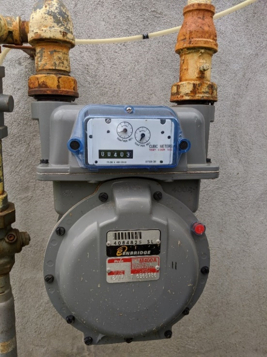
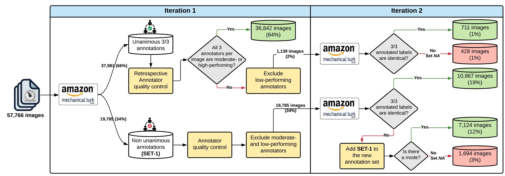

# NRC-GAMMA: A Novel Large Gas Meter Image Dataset

Automatic meter reading technology is not yet widespread. Gas, electricity, or water accumulation meters reading is mostly done manually on-site either by an operator or by the homeowner. In some countries, the operator takes a picture as reading proof to confirm the reading by checking offline with another operator and/or to use as evidence in case of conflicts or complaints. The whole process is expensive, time-consuming, and prone to errors. Automation can optimize and facilitate such labor-intensive and human error-prone processes. With the recent advances in the fields of artificial intelligence and computer vision, automatic meter reading systems are becoming more viable than ever. Motivated by this and to support open-access open-source efforts of the scientific community, we propose a novel large dataset of real-life gas meter images, named the __NRC-GAMMA__ dataset. 
The data were collected from an Itron 400A diaphragm gas meter on January 20, 2020, between 00:05 am and 11:59 pm. We employed a systematic approach to label the images, validate the labellings, and assure the quality of the annotations. 
The dataset contains 28,883 images of the entire gas meter along with easy-to-use well-documented scripts to create cropped images of the left and the right dials as well as the cyclometer (result in 86,649 cropped images). 
We hope the NRC-GAMMA dataset helps the research community to design and implement accurate, intelligent, and reproducible automatic gas meter reading solutions. Moreover, since the dataset contains labelled images of dial meters, we believe its applicability could be expanded to any utilities in which dial meters are used.

# Details on the Gas Meter Type

The data was collected from an Itron 400A gas meter installed and used in one of the test house facilities of the National Research Council of Canada (NRC), built in 2009 and located in Ottawa, Ontario. The gas meter is a light commercial (also suitable for high-load residential) gas diaphragm meter with a capacity of 400 ft3/hr (Figure 1).

__Figure 1.__ The Itron 400A gas meter
:------------------------:

# High-Level Conceptual Flow of the Quality Control Process

We comprehensively assessed the quality of annotations and annotators during the annotation process. __Figure 2__ shows the detailed flow of the annotation process as well as the quality control steps taken to verify the quality of the annotations and annotators. 
In total, 57,766 images (from the left and right dials) were sent to Mechanical Turk and a total of 173,298 annotations were processed. This resulted in 55,644 (96%) images with a clear unanimous label (10 classes representing zones 0-9 in the dials) and 2,122 (4%) 
images with NA label, 1,147 (2%) from the left dial and 975 (2%) from the right dial. Out of the processed 173,298 annotations, 10,026 were tagged as unacceptable (and rejected) and 163,272 as acceptable annotations. Of the unacceptable annotations, 63% were from the left
 dial, and 37% were from the right dial. Several R scripts were written to perform the quality control and check the integrity of the data. These R scripts are also available __upon request__.

__Figure 2.__ The high-level conceptual flow of the quality control process
:------------------------:

# Licence
Our goal is to encourage broad use of this dataset and contribution to the develpment of intelligent AI-driven gas meter reading systems. The NRC-GAMMA is an open-source open-access dataset under the terms of the __MIT License__. Please review the LICENCE document for terms. Contact the team if you wish to licence NRC-GAMMA under different terms.

# Core NRC-GAMMA Team
* Patrick Paul (patrick.paul@nrc-cnrc.gc.ca)
* Sofia Auer (sofia.auer@nrc-cnrc.gc.ca)
* Stephane Tremblay (stephane.tremblay@nrc-cnrc.gc.ca``)
* Ashkan Ebadi (ashkan.ebadi@nrc-cnrc.gc.ca)

# How to generate cropped images from the NRC-GAMMA Dataset?
1. Use create_cropped_NRC-GAMMA.ipynb to create cropped images using the default parameters mentioned in the metadata file
    * __Note 1:__ The generated files will be stored locally on the user's device under respective folders for left and right dials as well as the cyclometer. 
    * __Note 2:__ Make sure to modify the file paths in the code to your own paths, if reuqired.

# Requirements
To generate cropped images from the NRC-GAMMA dataset:
* Python >=3.6
* Pandas >=1.1.3
* Jupyter
* __TO BE MODIFIED__

# NRC-GAMMA Data Distribution
The dataset contains 28,883 images captured of the entire gas meter panel. Below, you may the distribution of the images per region of interest, i.e. left and right dials, and the cyclo meter.

Type | Count
--- | ---
__Left Dial__ | `28,883`
__Right Dial__ | `28,883`
__Cyclometer__ | `28,883`

# Issues
After reading the README and past/current issues use the [issue tracker](https://git-collab.nrc-cnrc.gc.ca/dac-iot-lab/gas-meter-dataset/-/issues) to report genuine bugs, mistakes or even small typos in the NRC-GAMMA project files. The tracker lets you browse and search all documented issues, comment on open issues, and track their progress. Note that issues are not meant for technical support; open an issue only for an error which is precise and reproducible.

# Contributing
You can contribute to the NRC-GAMMA initiative by providing/adding more data/data sources, building intelligent models using the dataset, implementing new features and functionalities in the scripts, correcting errors, or even improving documentation. Feel free to submit small corrections and contributions as issues in the [issue tracker](https://git-collab.nrc-cnrc.gc.ca/dac-iot-lab/gas-meter-dataset/-/issues). For more extensive contributions, familiarize yourself with git and github, work on your own NRC-GAMMA fork and submit your changes via a pull request.